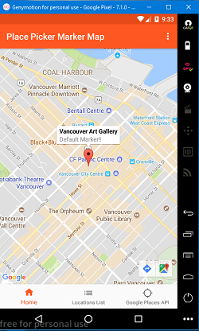
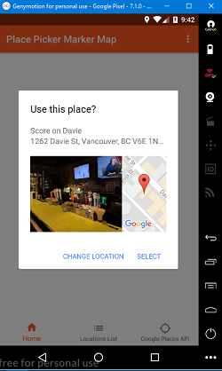

# PlacePickerMarkerMap
Using Google Places API, this Android App allows user to select, save, edit and retrieve a location with an added parameter and store in SQLite. Requires Google Play Services and API Key. Android Studio Project.

    
    
 

